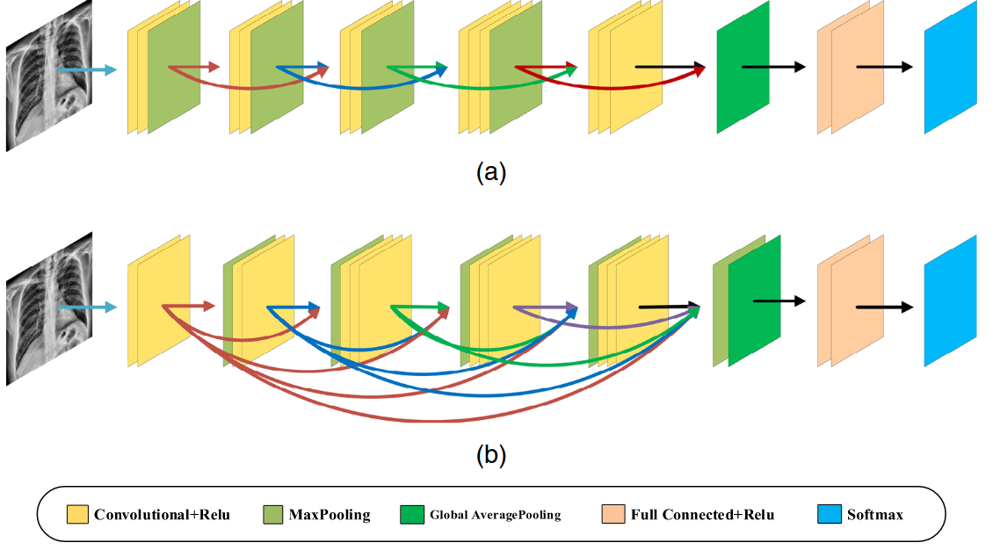

# COVID-19 detection method based on SVRNet and SVDNet in lung x-rays
This repository presents the implementation of `SVRNet` and `SVDNet` models from the paper [COVID-19 detection method based on SVRNet and SVDNet in lung x-rays](https://www.ncbi.nlm.nih.gov/pmc/articles/PMC8404611/pdf/JMI-008-017504.pdf).

## Install
We used python 3.8 to run this code. To install all requirements via pip:
```bash
$ pip install -r requirements.txt
```
## Data: COVID-19 Radiography Database (COVID-19 Chest X-ray Database)
You can download this dataset from [here](https://www.kaggle.com/tawsifurrahman/covid19-radiography-database?fbclid=IwAR3JBdbiHVJFYHcNlR3r3Z1esKY3UKrCHJd8Nrhv4OPXdGhOZWtEcqtjEEg). For preparing the dataset before training the model, the 11045 lung x-rays (Normal/COVID) images are selected as the training set and 2781 images (Normal/COVID) as the test set. The limited contrast adaptive histogram equalization (CLAHE) is applied to improve contrast in the images. To preprocess the dataset, you can run:
```bash
$ python --path_dataset 'COVID-19_Radiography_Dataset' --path_workspace 'classification-COVID-19_Radiography_Dataset' preprocessing_data.py
```
## Train the model
To train the model, you can run: 
```bash
python --model_name ['VGG16', 'SVRNet', 'SVDNet']  main.py
```
## Download trained models
To download the trained models click [here](https://www.dropbox.com/s/7nz7xbmlmh1r0g7/models.zip?dl=0)  

